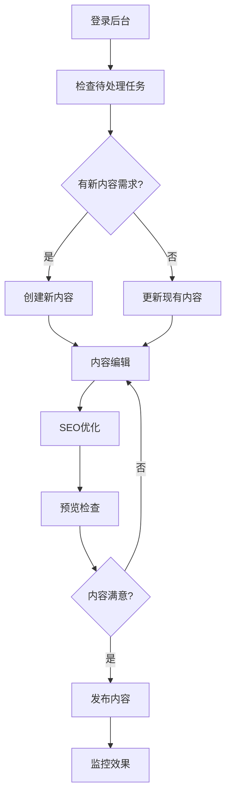

# South Pole 网站文档中心

欢迎来到 South Pole 网站文档中心！这里包含了网站管理、内容创建、技术维护等各方面的详细指南。

## 📚 文档目录

### 🎯 快速开始
- **[快速开始指南](./quick-start.md)** - 5分钟上手指南
- **[管理员操作手册](./admin-guide.md)** - 完整的CMS使用说明

### ✍️ 内容管理
- **[内容创建最佳实践](./content-best-practices.md)** - 写作和SEO优化指南
- **[图片处理规范](./admin-guide.md#31-图片尺寸要求)** - 图片上传和优化
- **[多语言管理](./admin-guide.md#34-多语言内容管理)** - 多语言内容发布

### 🔧 技术文档
- **[开发环境搭建](../README.md)** - 本地开发环境配置
- **[部署指南](../README.md#部署)** - Vercel部署说明
- **[性能优化](../README.md#性能优化)** - 网站性能优化

### 🆘 故障排除
- **[常见问题解答](./admin-guide.md#41-常见问题解答)** - FAQ和解决方案
- **[错误代码说明](./admin-guide.md#42-错误信息说明)** - 系统错误处理
- **[技术支持](./admin-guide.md#43-联系技术支持)** - 获取帮助的方式

## 👥 用户角色说明

### 🔑 超级管理员
- 系统设置和配置
- 用户权限管理
- 数据备份和恢复
- 技术问题处理

### 📝 内容管理员
- 新闻文章发布
- 案例研究更新
- 团队信息维护
- SEO内容优化

### ✏️ 内容编辑
- 文章撰写和编辑
- 图片上传和处理
- 内容审核协助
- 数据收集整理

### 👀 审核员
- 内容质量检查
- 合规性审核
- 发布前确认
- 反馈问题收集

## 🛠️ 网站功能概览

### 核心功能
```
✅ 响应式设计 - 支持所有设备
✅ 多语言支持 - 中英文切换
✅ SEO优化 - 搜索引擎友好
✅ 性能优化 - 快速加载
✅ 内容管理 - 易于维护
✅ 安全防护 - 数据保护
```

### 内容模块
```
📄 新闻中心 - 公司动态和行业资讯
📊 案例研究 - 项目成功案例展示
🏢 服务介绍 - 业务服务详细说明
👥 团队介绍 - 核心团队成员展示
📞 联系我们 - 多种联系方式
🔍 搜索功能 - 站内内容搜索
```

### 管理功能
```
🎛️ 内容管理系统 (CMS)
📈 访问统计分析
🔐 用户权限控制
💾 自动备份机制
🛡️ 安全监控
📱 移动端管理
```

## 📋 使用流程

### 新用户入门
1. **获取账户** - 联系IT部门开通
2. **阅读文档** - 查看快速开始指南
3. **熟悉界面** - 登录后端熟悉操作
4. **实践操作** - 尝试发布测试内容
5. **正式上手** - 开始日常内容管理

### 日常工作流程


## 📞 获取支持

### 紧急支持 (24/7)
- **电话**: +86-400-xxx-xxxx
- **邮箱**: emergency@southpole.com
- **企业微信**: South Pole IT Support

### 一般支持 (工作时间)
- **在线客服**: 网站右下角聊天窗口
- **邮箱**: support@southpole.com
- **工单系统**: https://support.southpole.com

### 培训和咨询
- **新人培训**: training@southpole.com
- **功能咨询**: consulting@southpole.com
- **定制需求**: custom@southpole.com

## 🔄 文档更新

### 更新周期
- **每周**: 检查用户反馈，更新FAQ
- **每月**: 根据功能更新调整文档
- **每季度**: 全面审核和优化文档
- **每年**: 重构文档结构

### 贡献指南
如果你发现文档有错误或需要补充：
1. 发送邮件至 docs@southpole.com
2. 详细描述问题或建议
3. 提供正确的信息（如适用）
4. 我们会在3个工作日内回复

### 版本历史
- **v2.1** (2024-01-15) - 完善多语言管理指南
- **v2.0** (2023-12-01) - 重构文档结构
- **v1.5** (2023-10-15) - 添加故障排除章节
- **v1.0** (2023-08-01) - 初始版本发布

## 🎓 推荐学习路径

### 内容管理员路径
1. **基础操作** (1天)
   - 登录和界面熟悉
   - 基础内容编辑
   - 图片上传处理

2. **进阶技能** (3天)
   - SEO优化技巧
   - 多媒体内容管理
   - 内容规划策略

3. **专家级别** (1周)
   - 数据分析解读
   - 用户体验优化
   - 内容营销策略

### 技术管理员路径
1. **系统管理** (2天)
   - 用户权限配置
   - 系统监控设置
   - 备份恢复操作

2. **性能优化** (3天)
   - 缓存配置管理
   - CDN设置优化
   - 数据库维护

3. **安全管理** (1周)
   - 安全策略配置
   - 风险评估处理
   - 应急响应流程

## 📊 网站统计

### 当前状态 (2024年1月)
```
📄 总页面数: 50+
🌐 支持语言: 2种 (中文/英文)
👥 注册用户: 15人
📈 月访问量: 10,000+
⚡ 平均加载时间: 1.2秒
📱 移动端访问占比: 45%
```

### 性能指标
```
✅ Google PageSpeed Score: 95/100
✅ 可用性: 99.9%
✅ 安全评级: A+
✅ SEO评分: 90/100
```

---

## 🎯 下一步计划

### 短期目标 (3个月)
- [ ] 优化移动端用户体验
- [ ] 增加视频内容管理功能
- [ ] 完善多语言内容
- [ ] 提升网站加载速度

### 中期目标 (6个月)
- [ ] 集成客户关系管理系统
- [ ] 添加在线客服功能
- [ ] 实现个性化内容推荐
- [ ] 扩展社交媒体集成

### 长期目标 (1年)
- [ ] 构建知识库系统
- [ ] 实现AI内容生成辅助
- [ ] 建立数据分析平台
- [ ] 开发移动端APP

---

*文档最后更新: 2024年1月15日*
*维护团队: South Pole IT & Marketing Team*